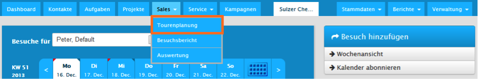

# Tourenplanung und Besuchsberichte (Zusatzmodul)

Mit dem Tourenplanung- Plugin können Vertriebsmitarbeiter, welche im Außendienst tätig sind, ihre Reisetätigkeit organisieren und optimieren. Von optimierter Umkreissuche bis individuellen Besuchsberichten lassen sich verschiedenste Vertriebsbesuche, umsetzen. Zu finden ist die Besuchsplanung in der Navigationsleiste unter _Sales - Tourenplanung_ bzw. _Sales -Besuchsbericht_.

<!-- BEGIN MANUAL -->













<!-- END MANUAL -->
