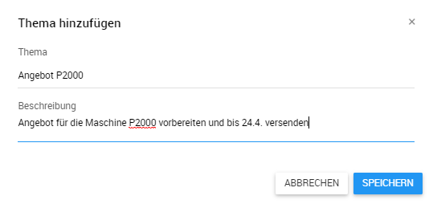

## Mobiler Vertrieb

Im Mobilen CRM findet sich die Tourenplanung im Hauptmenü Vertrieb:

Über den Schnellzugriff sieht man sofort die vorbereiteten und empfohlenen Besuche und hat die Möglichkeit einer Umkreissuche:

Im Bereich *Tourenplanung* werden alle Besuche angezeigt und können mit Hilfe der Suchparameter   im Popup Fenster in der Schnellzugriffsleiste unter anderem nach Plandatum, Firma, Besuchsziel, Adressdaten, und verantwortlichen Benutzer gefiltert werden. 

Zusätzlich zum Suchfilter lassen sich zugleich die Besuche mit der Schaltfläche  eingrenzen nach:

- Alle Besuchen (geplante und vorbereitete Besuche)

- Geplante Besuche (Besuche mit eingetragenem Besuchsdatum)

- Vorbereitete Besuchen (Besuche ohne Besuchsdatum)

Die Ansicht lässt sich unter der Schaltfläche   zwischen *Kalender- und Listenansicht* umschalten, wobei Die Listenansicht über die Schaltfläche  um eine *Kartenansicht* erweitert werden kann.

### Kalenderansicht

Die Kalenderansicht ermöglicht übersichtliche Planung der Besuche. Sie lässt sich  über die Schaltfläche  zwischen Monats, Wochen sowie Tagesansicht umschalten. Der Monatstag des aktuellen Datums wird orange gekennzeichnet. 

**Hinweis:** Durch das Anklicken des Eintrags wird der gewählte Besuch geöffnet.

### Listenansicht

Die Listenansicht *Besuche* enthält folgende Eckdaten sind:

- Firmenname
- Plandatum und Uhrzeit für den Besuch
- Adressinformationen (hinterlegte Adresse zur Firma)
- Besuchsziel auch Besuchsgrund oder messbares Ziel von dem Besuch
- Verantwortlicher Ansprechpartner

Die Sortierung erfolgt durch die beiden Schaltflächen  wobei man das sortierende Feld nach Kunde (gehört zu) und Plandatum bestimmen und die Reihenfolge nach auf- / absteigend einstellen kann. 

Der Anwender kann das Datum für ungeplante und bereits geplante Besuche schnell anpassen über die Schaltfläche  und somit ideal seine Tour planen.

### Kartenansicht (mit Listenansicht)

Über die Schaltfläche lässt sich die Kartendarstellung aktivieren, und die Besuche können anhand der hinterlegten Adressen auf der Karte anzeigen und äquivalent zur normalen Listenansicht genutzt werden. Zur Übersicht werden naheliegende Besuchsadressen in Gruppen mit Angabe der Firmenzahl dargestellt. Durch Anklicken des Gruppenzeichens wird die Ansicht auf den Gruppenbereich hineingezoomt. Über die Schaltfläche wird man zum eigenen Standort wieder zurückgeführt.

Mit der Aktivierung der Checkbox *AUF KARTE SUCHEN* wird die Liste mit empfohlenen Besuchen angezeigt auf die sichtbaren Besuchsstandorte eingeschränkt. Dadurch kann der Anwender ideal seine Tour planen und nur noch das Datum und Uhrzeit vereinbaren und eintragen.

### Neuen Besuch anlegen

Über die Schaltfläche können neue Besuchstermine angelegt werden. Mit * gezeichneten Felder sind Pflichtfelder.

***Hinweis**:* Beim Besuchsziel kann der Anwender einen Vorschlag (z.B. *Kundenbetreuung*) auswählen oder die Option *Eigenes Ziel angeben* auswählen und eigenes Besuchsziel eingeben.

### Besuchsakte

#### Layout

Die Besuchsakte bietet dem Anwender eine detaillierte Auskunft über alle hinterlegten Informationen zum Kundentermin. Im linken Bereich werden der Firmenname, verantwortlicher Ansprechpartner, sowie die Besuchsadresse abgebildet.

Über das Register können Details zu den jeweiligen Themen im Informationsbereich aufgerufen werden.

#### Register - Details

Das Register Details ist die Anfangsansicht einer Besuchsakte. Hier werden Allgemeinen Informationen zum Termin angezeigt (u.a. Firma, Besuchsziel und Termin Dauer) und können über die Schaltfläche bearbeitet werden. Ferner können weitere Kontaktpersonen im Freitext-Feld eingegeben werden. 

**zu Hintergrundinformationen**: Die Hintergrundinformationen werden auf der Firmenakte in die Besuche vererbt, sodass der Anwender die relevanten Kundeninformationen zur Anzahl der benötigten Besuche beim Kunden vor Ort, sowie die den Turnus erhält. Das Freitext-Feld Hintergrundinformationen lässt sich über die Schaltfläche  Besuch-spezifisch anpassen.

#### Register - Themen

Im Rahmen der Vor-/Nachbereitung von Besuchstermin kann der Anwender im Register Themen systematisch die relevanten Punkte protokollieren.

Die Themen lassen sich durch wieder bearbeiten oder löschen.

#### Register - Notizen & Aufgaben

Im Register Aufgaben werden alle besuchsspezifischen Notizen und Aufgaben in Form der Listenansicht angezeigt. Mehr Informationen siehe Kapitel *Firma* -> *Aufgaben*/*Notizen*.

#### Register - Teilnehmer

Im Register Teilnehmer werden alle zum Besuch hinterlegten Personenkontakte abgebildet. Über die Schaltfläche  können weitere Personen hinzugefügt werden. Neben Name, können auch Informationen zur Beziehung hinterlegt werden. Firma, Position und Initialen werden nach dem *Speichern* aus den Stammdaten automatisch bezogen.

#### Register - Besuchsberichte

Neben protokollierten Punkten im Register Themen kann der Anwender strukturiert das Kundengespräch protokollieren und führen und bietet somit eine solide Vorgehensweise. Mit Hilfe von Besuchsberichten können standardisierte Rückmeldungen zu Produkten und fortlaufenden Verbesserung des Markauftritts genutzt werden. 

**Ablauf:**

1. Die **Besuchsbericht-Vorlagen** können im Backend durch den Innendienst mit vorbelegten Auswählmöglichkeiten beliebig konfiguriert werden. 

2. Der Anwender kann zu jedem Besuch auf Basis von Besuchsbericht-Vorlagen sein **Besuch-spezifischen Bericht** erstellen.

   

   3. Beim Kundenbesuch kann der Bericht in Begleitung vom Anwender durch Kunden systematisch ausgefüllt und anschließend unterschrieben werden. Mit dem Hacken *Besuchsbericht abschließen* und *SPEICHERN* wird der Bericht abgeschlossen.

      