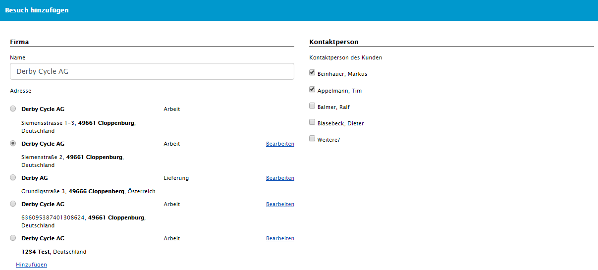
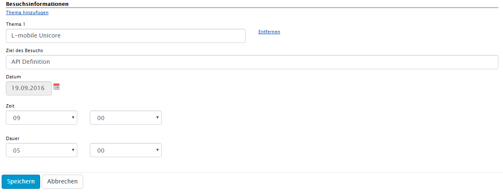
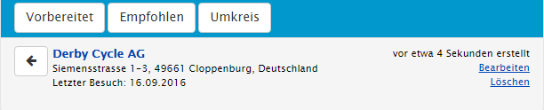
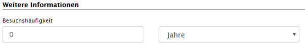

##	Tourenplanung

Ein Besuch lässt sich mit zwei verschiedenen Methoden anlegen. Mit Besuch anlegen wird per Dialogmenü ein Besuch zu einer gezielten Firma erstellt. Mit der Option Umkreissuche lässt sich ein Besuch zu einer Firma anlegen, welche geografisch naheliegend ist.

### Besuch hinzufügen über Dialogfunktion

Nach dem Betätigen des Buttons „Besuch hinzufügen“ gelangt man in den Erstellungsdialog. 
Im oberen Teil dieses Dialogs wird die Firmenadresse durch Auswahl über Autovervollständigung und anschließend die Kontaktperson ausgewählt. Ist eine Adresse nicht vorhanden befindet sich unten im Firmenteil die Option eine Adresse hinzuzufügen. Dadurch gelangt man in den Adresseditor. Fehlt eine Kontaktperson lässt sich direkt im Editor unter Setzen des Häkchens _Weitere?_ ein beliebiger Name eintragen. Auch ist die Auswahl von mehreren Kontaktpersonen möglich.

Im unteren Teil des Formulars befindet sich der Besuchsinformations-Teil. Hier werden die inhaltlichen Informationen zu diesem Besuch angegeben wie Thema, Ziel und Zeitpunkt. Themen lassen sich unter _Thema hinzufügen_auch mehrfach hinzufügen. Das Ziel des Besuches wird im der darunter befindenden Textfeld eingegeben. Durch das Hinzufügen von Datum, Uhrzeit, Dauer lässt sich der Termin genauer festlegen.

### Besuch hinzufügen über Umkreissuche

Diese Funktion dient zur Optimierung von Touren. Hier lassen sich die nächst gelegenen Kunden heraussuchen und über den Pfeil nach Links einfügen. Die Umkreissuche erfordert zunächst einen Standpunkt, aus dem die Suche erfolgen soll. 

Dieser kann durch die Option _eigener Umkreis_ die eigene Position ein, oder durch _Umkreis einer Adresse_ ein bestimmter Punkt. Mit der Funktion eigener Umkreis wird zunächst die Position des Rechners bzw. mobilen Gerätes ermittelt. Daraufhin folgt eine Liste mit Firmen, Adresse und deren Entfernung. 

Die Umkreissuche von Adresse erfordert die Eingabe von Ort, PLZ oder Straße. Ob nun alle drei ausgefüllt sind oder nur ein Feld macht nur den Unterschied in der Genauigkeit der Suche. Zu empfehlen ist auf jeden Fall die Eingabe von PLZ um falsche Ergebnisse durch gleichnamige Ortschaften zu vermeiden.

### Empfohlene Besuche - Besuchsplanung

Durch die _Empfohlen_ Funktion in der Tourenplanung können die Firmen herausgesucht werden, bei denen ein Besuch notwendig ist. Dazu ist die Angabe der Besuchshäufigkeit **(1)** erforderlich, welche im Firmenstamm gesetzt werden kann. In diesem Fall einmal pro Quartal.

