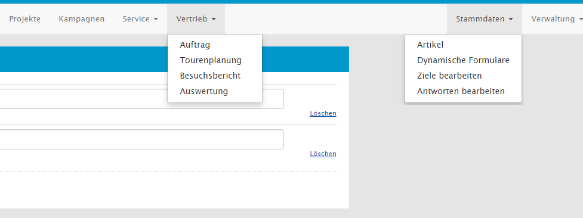
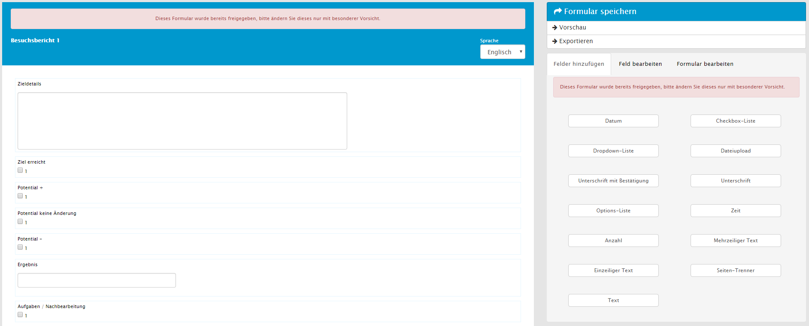

## Besuchsbericht

Neben einem Feedback zur Kundenzufriedenheit bieten Besuchsberichte relevante Informationen für weitere Maßnahmen. Außerdem ist mit diesen eine Struktur für Kundengespräche gegeben und bietet somit eine solide Vorgehensweiße. Des Weiteren dienen Rückmeldungen zu Produkten der fortlaufenden Verbesserung des Markauftritts und der Produkte. Zusätzlich können die dortigen Formulare und vorbelegten Auswählmöglichkeiten beliebig konfiguriert werden. Ausgefüllte Besuchsberichte sind unter *Sales*, *Besuchsbericht* zu finden. Unter *Stammdaten*, *Dynamische Formulare* können Besuchsberichte im Formulardesigner erstellt und zur Verwendung freigegeben werden.

### Besuchsbericht konfigurieren

In den Dynamischen Formularen können neue Formulare erstellt werden. Damit diese als Besuchsbericht verfügbar sind, müssen diese unter der Kategorie _Besuchsbericht_ angelegt und freigegeben werden.

Die Bearbeitung der Besuchsberichte ist äquivalent zu der Bearbeitung anderer dynamischen Formulare. Details zur Bearbeitung und der zur Verfügung stehenden Element, finden Sie unter _Dynamische Formulare_ in dieser Leistungsbeschreibung

