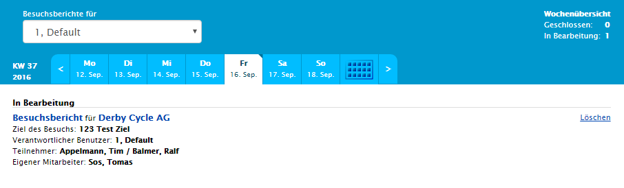

## Besuchsübersicht

In der Sales – Tourenplanung befindet sich zunächst die Besuchsübersicht. Dort sind alle anstehenden, sowie alle Abgeschlossenen Besuche zu finden. Diese sind ein einem übersichtlichen und einfach zu bedienenden Kalender- Listenmodell abgebildet.

Im oberen Bereich befindet sich ein einfaches Bookmark.  Mit diesem können die Besuche nach Benutzer gefiltert werden. Direkt darunter befindet sich die Datumsleiste. In dieser sind offene Berichte mit einer zusätzlichen roten Ecke markiert und abgeschlossene nur mit einer schwarzen. Zusätzlich lässt sich der Kalender mit dem Rechten Button ein- und ausklappen.

Unter dem Kalender befindet sich nun die Liste, welche für den, im Kalender ausgewählten Tag gilt. In dieser sind alle Informationen zum Besuchstermin, sowie Optionen zum Bearbeiten und Löschen. Die Option zum Besuchsbericht  anlegen ist nur vorhanden, wenn dieser Besuch Termingemäß vorbei oder in der Durchführung ist, da es keinen Sinn ergibt, Besuchsberichte vor dem Besuch anzulegen.

## Kontextmenü – Funktionen

Im Kontextmenü sind die Optionen Besuch hinzufügen, Wochenansicht / Tagesansicht, Kalender abonnieren sowie eine Umkreissuche vorhanden, um von einem bestimmten Punkt nahe liegende Touren zu planen.

Die Funktionen Besuch hinzufügen und Umkreissuche werden weiter unten beschrieben.

### Wochen- /Tagesansicht
Mit der Funktion Wochenansicht / Tagesansicht lässt sich die Besuchsliste erweitern. Diese zeigt danach anstatt den ausgewählten Tag die ausgewählte Kalenderwoche. Durch erneutes Klicken des Buttons kann man zurück auf die Tagesansicht wechseln.

### Kalender abonnieren
Mit Hilfe der Funktion Kalender abonnieren werden die Besuche des ausgewählten Benutzers in den persönlichen Kalender importiert. Dies funktioniert wieder als Download (.ics) welchen man über das gewählte Kalenderprogramm ausführt.

