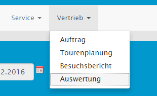
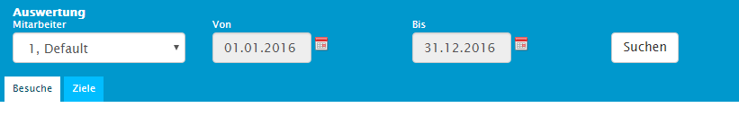
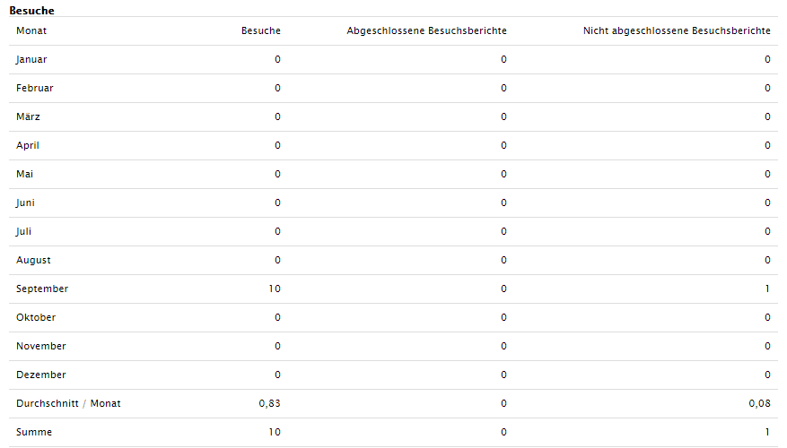
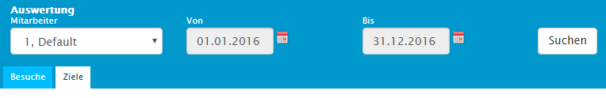
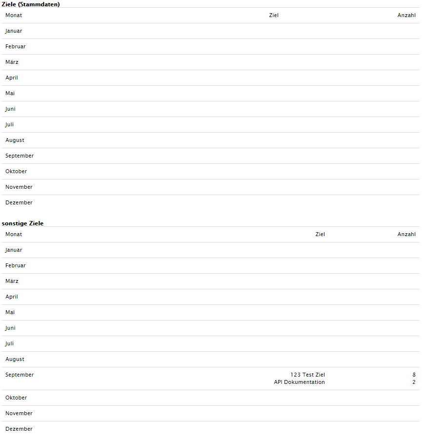

### Besuchsauswertung

Mit der Besuchsauswertung kann man sich einen Überblick über die Aktivitäten im Vertrieb verschaffen. Zum Beispiel lassen sich neben der Besuchsquantität, Erfolgsquoten für Ziele, Gesprächsthemen und Potenziale ableiten. Zusätzlich ist festgehalten ob es noch nicht abgeschlossene Besuchsberichte gibt, oder gar Besuche ohne Bericht. Zu finden ist die Besuchsauswertung unter Sales, Auswertung.

Ist man in der Auswertung angelangt findet man die quantitative Auswertung für Besuche unter dem Tab _Besuche_ (1). Diese sind im oberen Bereich nach Monaten, im Unteren nach Kalenderwochen unterteilt. In der Filterleiste lassen sich Personen **(2)** auswählen, sowie auch der Zeitraum **(3)** der Statistik.

In einem Beispiel wurde der Zeitraum auf Januar und Februar eingestellt. Dort sind im September unter Besuche Zehn ersichtlich. Diese Zahl enthält alle eingeplanten Besuche im Tourenplaner in diesem Zeitraum. In der nächsten Spalte sind null abgeschlossene Besuchsberichte hinterlegt. Da allerdings in der letzten Spalte ein nicht abgeschlossener Besuchsbericht vorhanden ist, lässt sich daraus schließen, dass es einen Besuch gibt, der noch keinen Bericht enthält. Auf jede Statistik folgen hier noch eine Summierung und eine Durchschnittsberechnung.

Die Zielauswertung befindet sich einen Tab weiter unter *Ziele* .

In dieser Ansicht wird festgehalten, welche Ziele wie oft verwendet werden. Diese werden in zwei Kategorien unterteilt: *Ziele* (Stammdaten)_ **(1)** und *Sonstige Ziele* **(2)**. _Ziele Stammdaten_ sind Ziele, die in der Zielkonfiguration vorgegeben wurden. Sonstige sind Ziele, welche im Besuchsbericht oder in der Tourenplanung per Textfeld hinzugefügt wurden. Mit der Zielauswertung lässt sich feststellen welche Ziele und vor allem welche Produkte, die sich hinter den Zielen befinden, am meisten gefragt sind.

