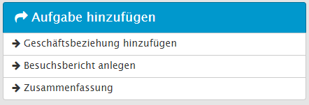
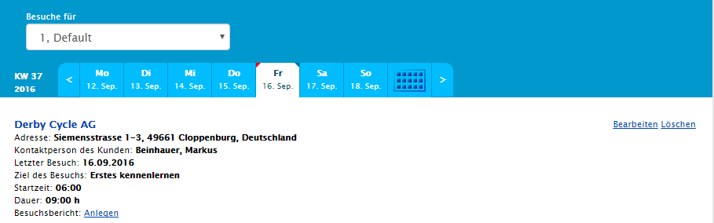
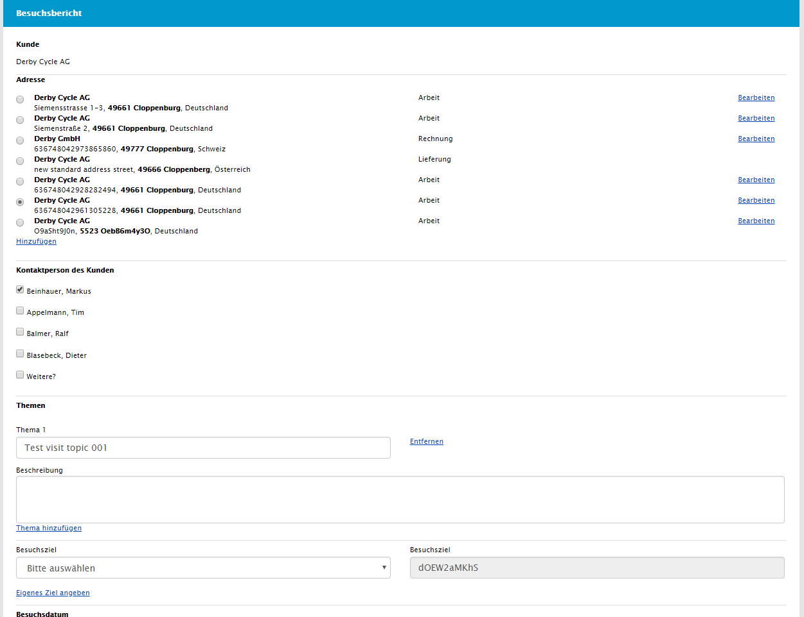
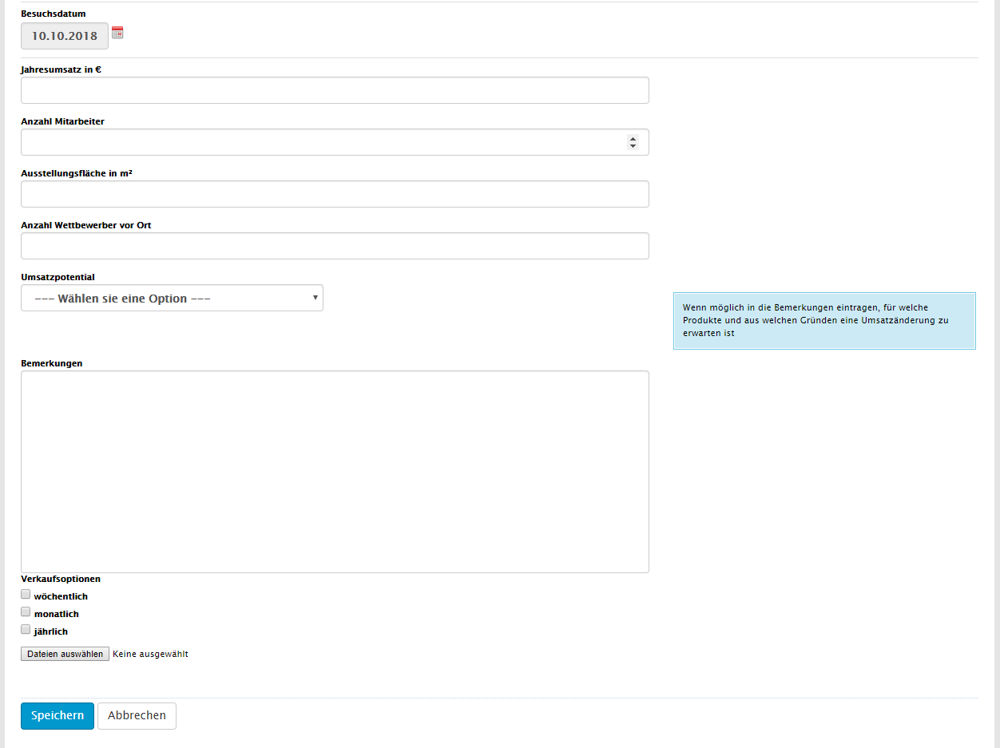
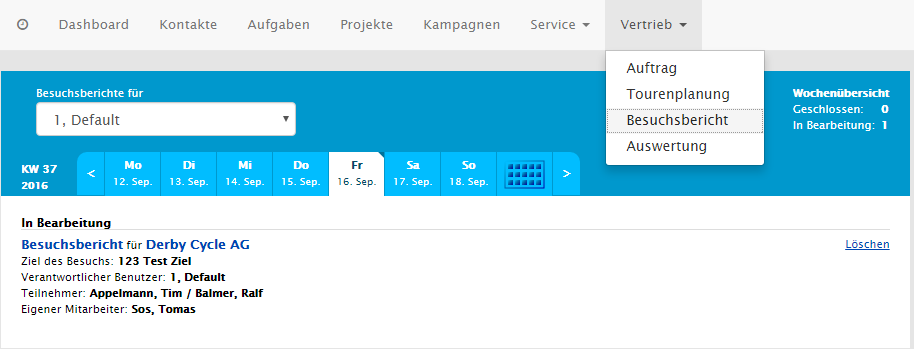
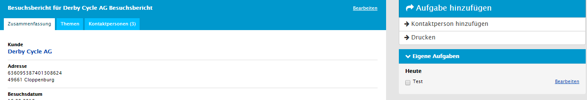
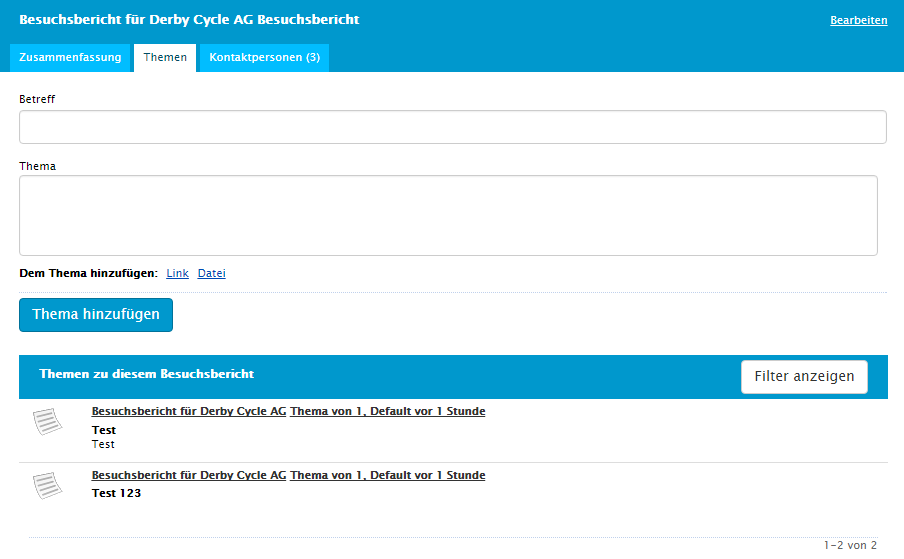
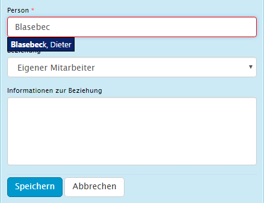
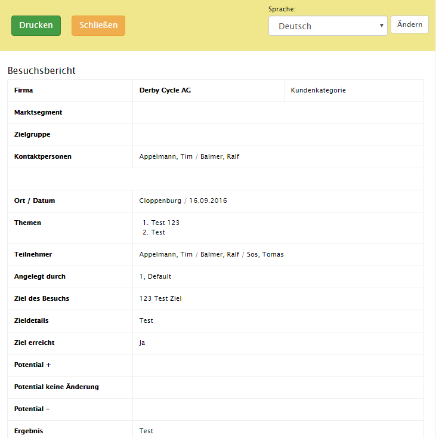
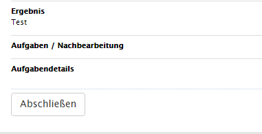

### Besuchsbericht anlegen

Im L-mobile CRM gibt es mehrere Möglichkeiten einen Besuchsbericht anzulegen. Die erste Option dazu bietet sich in den Kontaktdetails einer Firma. Dort befindet sich die Funktionalität rechts in den Kontextfunktionen.

Die nächste Option befindet sich in der Tourenplanung. Die Funktion ist hier in Form eines Links _Besuchsbericht anlegen_ unter jedem Eintrag verfügbar, sobald der Besuchszeitpunkt vor der aktuellen Zeit liegt.

Da es mit dem Anlegen nicht getan ist, wird man automatisch zum Editor weitergeleitet. Dort wird nun der Besuchsbericht ausgefüllt und ggf. die Fragen beantwortet. In den oberen Abschnitten lassen sich nochmals Adresse, Kontaktperson, Thema und Ziel korrigieren, falls die Firma vorbelegt ist. Ist eines dieser Kriterien nicht vorhanden lassen sich diese dort auch komplett hinzufügen.

Im unteren Teil des Besuchsberichts befinden sich alle Fragen. Die Möglichkeiten zur Darstellung beschränken sich auf die verfügbaren Elemente der dynamischen Formulare:

### Besuchsbericht bearbeiten

Nach dem der Bericht ausgefüllt ist gelangt man zu den Details zum Besuchsbericht. Dort kann man ihn nochmals bearbeiten, Kontaktpersonen und Themen anfügen oder auch den ganzen Bericht Löschen.
Diese ist auch über die Besuchsberichtübersicht zu erreichen. Man findet diese unter Sales -> Besuchsbericht.

Dort sucht man sich über den Kalender den gewünschten Bericht heraus und öffnet ihn mit dem Link _Besuchsbericht_. Auch hier bietet sich die Möglichkeit den Bericht zu löschen.

In der folgenden Detailansicht sieht man den kompletten Besuchsbericht in Überblick. Zusätzlich sind hier Themen und Kontaktpersonen separiert in Tabs untergebracht. In den Rechten Kontextfunktionen sind die Optionen Aufgabe hinzufügen, Kontaktperson hinzufügen und Drucken untergebracht.

Themen lassen sich hier wie Notizen hinzufügen. Diese erscheinen danach auch in der Druckversion mit Beschreibung. Dazu einfach einen Betreff eingeben, das Thema beschreiben und hinzufügen.

Kontaktpersonen werden im gleichnamigen Tab eingesehen, werden allerdings nicht wie die Themen dort hinzugefügt. Dazu ist die Kontextfunktion _Kontaktperson hinzufügen_ zuständig. Unter dieser verbirgt sich ein kleiner Editor, indem man per Autovervollständigung eine Person sucht und diese hinzufügt. Optional kann man auch Informationen in das Textfeld darunter schreiben. Unter Beziehung kann man den Bezug der Person auf den Besuchsbericht definieren.

Mit der Funktion _Drucken_ gelangt man erst in eine Druckvorschau. In dieser sind noch einmal alle Informationen, wie auch Kontaktpersonen und Aufgaben ersichtlich. Sind diese korrekt, muss nur noch mit dem Button _Drucken_ gedruckt werden.

Sobald alle Informationen korrekt sind oder ggf. korrigiert wurden kann man den Besuchsbericht in der Zusammenfassung (Ausgangsstellung Besuchsberichtdetails) abschließen. Damit lässt sich dieser nicht mehr bearbeiten und zählt in der Besuchsauswertung mit.

