## Die neue Webbasierte Plantafel

### Plantafel- Prozessbeschreibung

Die L-mobile Plantafel ist eine Anwendung zur Unterstützung der Personal- und Ressourceneinsatzplanung mit einer grafischen Oberfläche und ergänzenden Tools. Die Anwendung benötigt die L-mobile Basis SMS oder das aus einem ERP-System bereit gestellte Datenmodell und kann  mit dem Modul Mobiler Techniker Client optional erweitert werden.

### Öffnen der Plantafel

Zum aufrufen der Plantafel:

- Öffnen Sie die Profilinfo im Burger-menue
- Führen Sie die Plantafel Schaltfläche aus
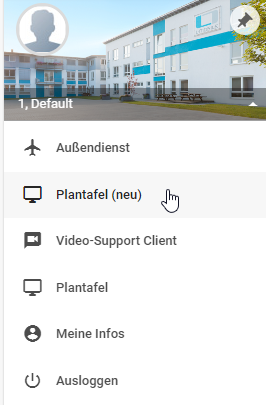
Alternativ öffnen Sie die Plantafel direkt nachdem Login.
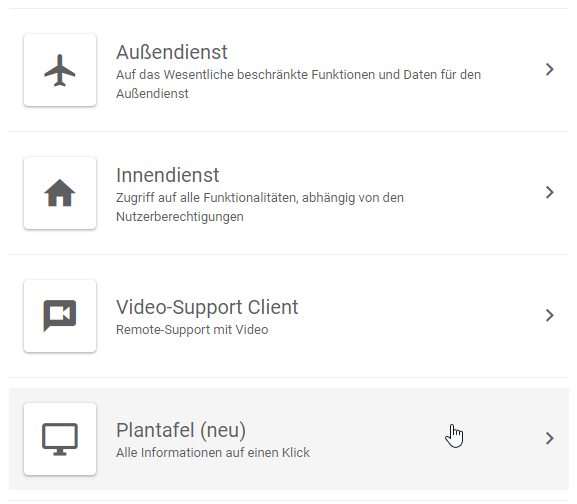

### Profile

Ein Profil beinhaltet die Konfigurationen der Plantafel wie z.B. Darstellungsoptionen, Planungsrahmen und die Ressourcen(Techniker und Werkzeuge).

#### Neues Profil erstellen

Um ein neues Profil zu erstellen gehen Sie wie folgt vor:

- Führen Sie die **Profilschaltfläche**  oben in ihrer Navigationsleiste aus.
- Führen Sie die **Schaltfläche Neues Profil** aus
- Es öffnet sich ein Formular, vergeben Sie einen Namen für das Profil, optional können Sie es mit einem Haken zum Standardprofil machen.

Wenn Sie nun erneut die Profilschaltfläche in der Navigationsleiste ausführen, sollte dort der Name des neu erstellen Profils, hinter "Aktuell:" stehen.

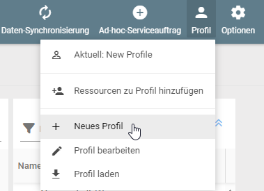

#### Profil Laden

Sie haben die Möglichkeit zwischen verschiedenen Profilen von Ihnen oder von Mitarbeitern erstellt wurden zu wechseln. Gehen Sie folgendermaßen vor:

- Führen Sie die **Profilschaltfläche** oben in ihrer Navigationsleiste aus
- Führen Sie die Schaltfläche **Profil Laden** aus
- Wählen Sie eins ihrer Profile aus oder setzen Sie den Haken unter der Auswahl um auch die Profile von anderen Nutzern auswählen zu können.

Wenn Sie nun erneut die Profilschaltfläche in der Navigationsleiste ausführen, sollte dort der Name des neu erstellen Profils, hinter "Aktuell:" stehen.

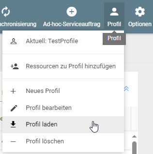

#### Ressourcen zum Profil hinzufügen

Ressourcen(Techniker und Werkzeuge), können Sie einem Profil zuordnen, dafür müssen Sie das Profil geladen haben, ist dies bereits passiert, gehen sie folgendermaßen vor:

- Führen Sie die Profilschaltfläche oben in ihrer Navigationsleiste aus
- Führen Sie die Schaltfläche **Ressourcen zu Profil hinzufügen**
- Fügen Sie Techniker und Werkzeuge als Ressource hinzu, dafür wählen Sie, die Techniker einzeln aus
- Entfernen Sie versehentlich ausgewählte Techniker mit einer erneuten Auswahl
- Speichern Sie
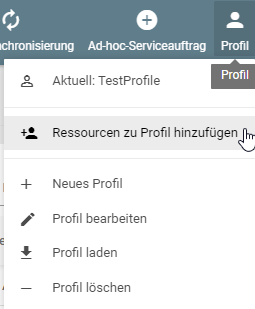
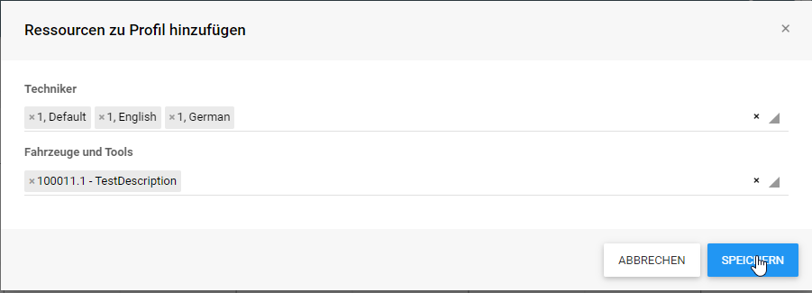
***Wichtig*: Sie können auch Techniker hinzufügen ohne aktive Lizenz, z.B. wenn sie mit externen Technikern arbeiten.**

#### Profil bearbeiten

Konfigurieren Sie das Profil nach Ihren Vorstellungen:

- Führen Sie die Profilschaltfläche oben in ihrer Navigationsleiste aus
- Führen Sie die Schaltfläche **Profil bearbeiten** aus
- Es öffnet Sich ein Formular zum bearbeiten des Profils

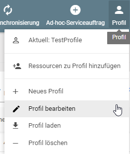

#### Cache konfigurieren

In den Feldern Untere Grenze und Obere Grenze können Sie einstellen in welchem Zeitraum Daten(Aufträge) geladen werden.
Wählen Sie einen größeren Bereich dauert das Laden der Daten entsprechend länger und bei einer Reduzierung des Zeitraums kann die Ladezeit verringert werden.
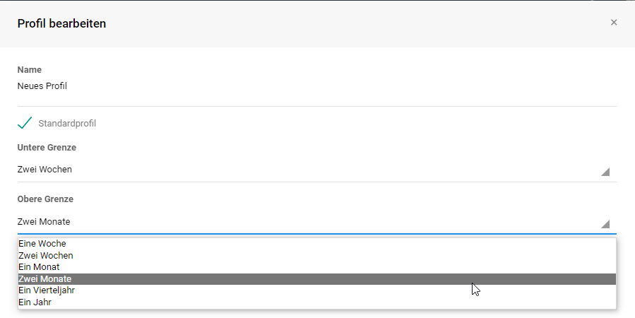

#### Zeilenhöhe anpassen

Sie können unter Profil bearbeiten auch die Zeilenhöhe der Ressourcen Liste und des Planungsvorrats anpassen. Je mehr Elemente in einer Liste sind desto schneller verliert man die Übersicht, daher bietet sich bei steigender Anzahl an Elementen an die Zeilenhöhe zu reduzieren.

#### Planungsvorrat konfigurieren

In den Profileinstellungen können Sie ebenfalls die Ordnung der Elemente im Planungsvorrat sortieren. Z.B. Status, Postleitzahl, Kunde etc.
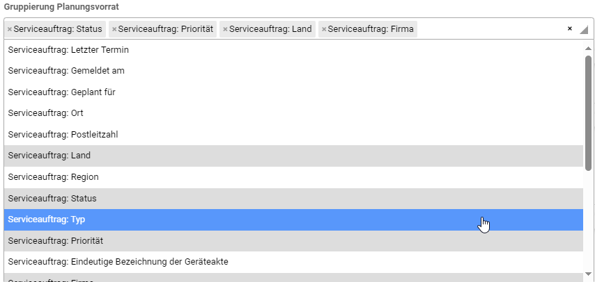

#### Tooltips anpassen

Sie können die Informationen welche im Tooltip erscheinen unter Profil bearbeiten anpassen.
Der Tooltip sind die Informationen wenn Sie mit der Maus über der Schaltfläche eines Auftrags oder eines Technikers drüber schweben ohne mit der Schaltfläche mit einem Mausklick zu interagieren.

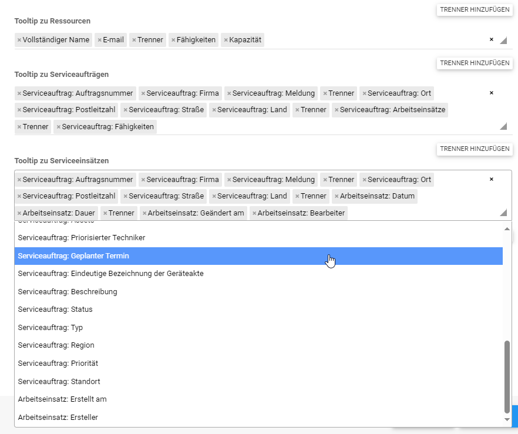

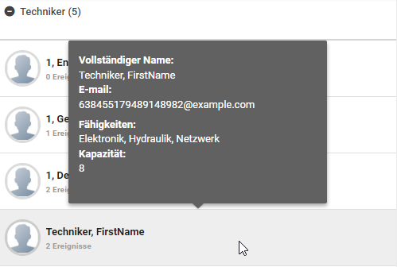

### Alternative Ansichten

Sie haben zwei weitere Ansichten zur Verfügung:

- Ein Kapazitätsgebirge welchen Ihnen die Auslastung der "Ressourcen(Techniker und Werkzeuge)" anzeigt
- Eine Karte welche Ihnen Ihre Serviceobjekte und Aufträge anzeigt

Das Ein- und Ausblenden der Ansichten ist über die Optionen Schaltfläche in der Navigationsleiste möglich.

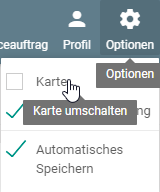

#### Plantafel Darstellung / Ansicht verändern / verschieben

Sie können die einzelnen Anwendungselemente in der Plantafel nach Ihren eigenen Bedürfnissen verschieben, durch die grauen Balken zwischen den Anwendungselementen können Sie sie bestimmen wie viel Platz jedes einzelne einnimmt.

#### Karte in einem zusätzlichen Fenster darstellen

Die Karte können Sie nach der Aktivierung in einem zusätzlichen Fenster darstellen, indem Sie das blaue Symbol, in der rechten oberen Ecke der Karte betätigen.

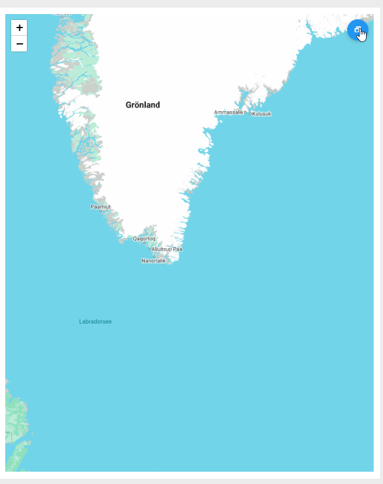

### Aufträge einplanen

Möchten Sie Aufträge einplanen, müssen Sie vorher ein Profil erstellt/geladen haben, Techniker hinzugefügt haben und Aufträge zum einplanen vorbereitet haben.

#### Drag and Drop

Wenn Sie bereits alles vorbereitet haben können Sie über die "Drag & Drop" Funktion Aufträge aus der Pipeline (Die Liste rechts in der Plantafel) auf einen Mitarbeiter ziehen.

#### Automatisches Speichern

Über die **Optionen** Schaltfläche in der Navigationsleiste können Sie das automatisches Speichern an und aus schalten.

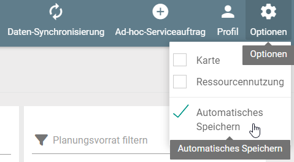

Wenn Sie mehrere Einsätze Planen müssen und erstmal noch etwas rumprobieren möchten, ist es zu empfehlen die Funktion auszuschalten.

Wenn Sie die Funktion Deaktivieren dann müssen Sie manuell die Datensynchronisation ausführen, sonst ist ihre Einteilung in der Plantafel nach einem neu Laden der Plantafel nicht mit dem Server synchronisiert und verschwunden.

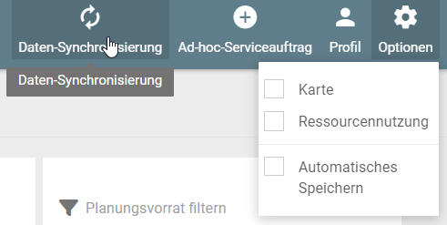

#### Mehre Personen und Werkzeug zu einem Auftrag hinzufügen

Möchten Sie mehrere Personen oder Werkzeug zu einem Auftrag hinzufügen, dann gehen Sie einfach auf den Auftrag der bereits in die Plantafel gezogen wurde, betätigen Sie Schaltfläche mit einem Rechtsklick, gehen Sie auf bearbeiten und fügen Sie einen weiteren Techniker hinzu.

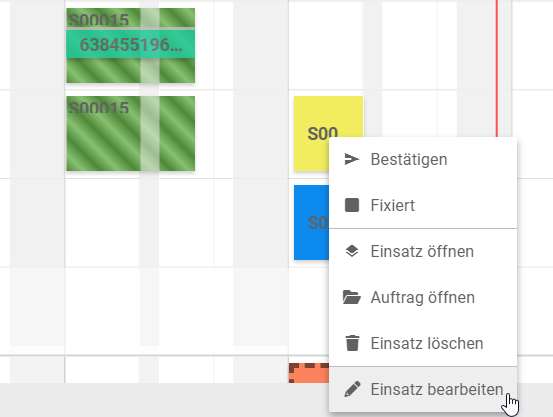

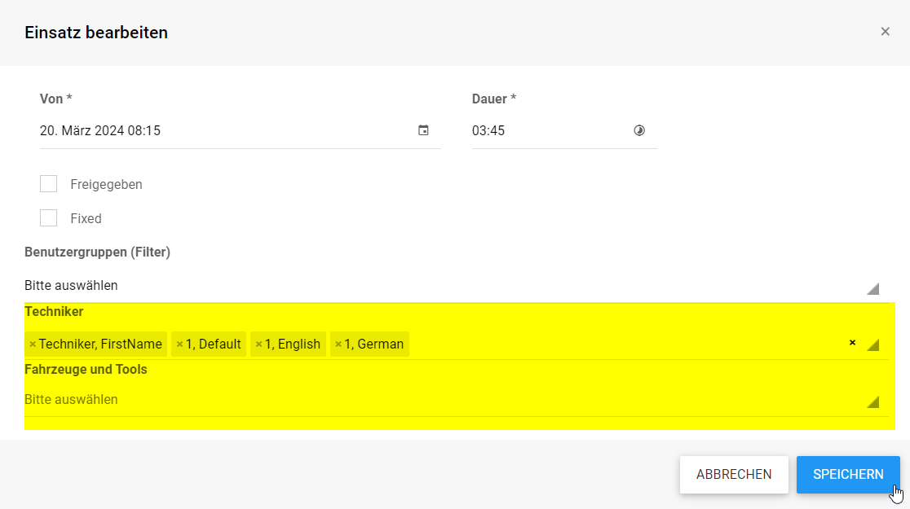

#### Auftrag Fixieren

Gehen Sie hierfür auf den Auftrag der bereits in die Plantafel gezogen wurde, betätigen Sie Schaltfläche mit einem Rechtsklick, setzen Sie einen Haken bei "Fixed" oder gehen Sie auf Auftrag bearbeiten und fixieren Sie den Auftrag mit einem Haken bei "Fixed". Der Auftrag kann nun nicht mehr verschoben werden.

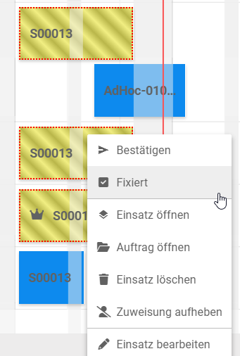

#### Auftrag Bestätigen

Gehen Sie hierfür auf den Auftrag der bereits in die Plantafel gezogen wurde, betätigen Sie Schaltfläche mit einem Rechtsklick, führen Sie die Bestätigen Schaltfläche aus oder gehen Sie auf Auftrag bearbeiten und machen Sie einen Haken bei Auftrag Freigegeben. Der Auftrag kann nun nicht mehr verschoben oder geändert werden.

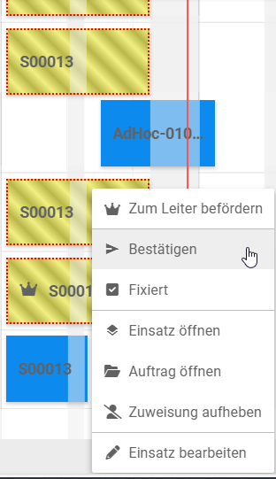

### Informationen Filtern

In der Plantafel haben Sie die Möglichkeit die Informationen zu filtern.

- Mit der Legende, können Sie nach den jeweiligen Attributen Filtern z.B. Abgeschlossen, Eingeplant, Gelesen usw.
- Mit dem Ressourcen Filter können Sie die Techniker und Werkzeuge filtern
- Mit dem Ereignisse Filter, können Sie nach Elementen die Bereits in die Plantafel geschoben wurden suchen, eine Einsatznummer oder z.B. nach Abwesenheiten wie Urlaub.  
- Mit dem Planungsvorrat Filter können Sie nach Elementen im Planungsvorrat Filtern z.B. nach eingestellten Gruppierungen wie Freigegeben und Eingeplant, Postleitzahlen, Kunden etc. oder z.B. nach der Auftragsnummer.
  
  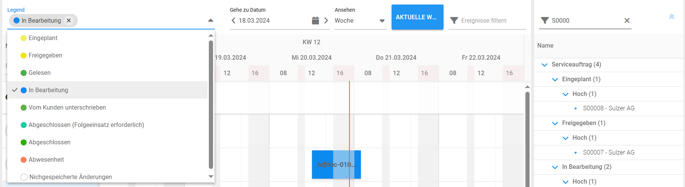